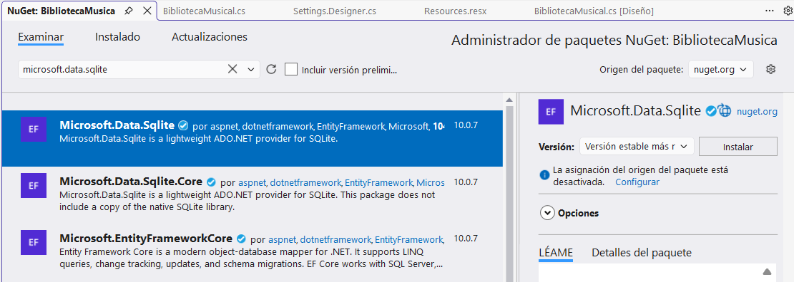

## Proceso para cada proyecto

- Se puede instalar haciendo clic derecho en dependencias e instalando como un paquete NuGet Debemos buscar Microsoft.Data.Sqlite **SE INSTALA POR PROYECTO**

!!! info "¿Qué es Nuget?"
    - NuGet es el administrador de paquetes oficial para .NET
    - Acabaremos añadiendo using Microsoft.Data.Sqlite; en nuestro .cs

## Captura de pantalla

